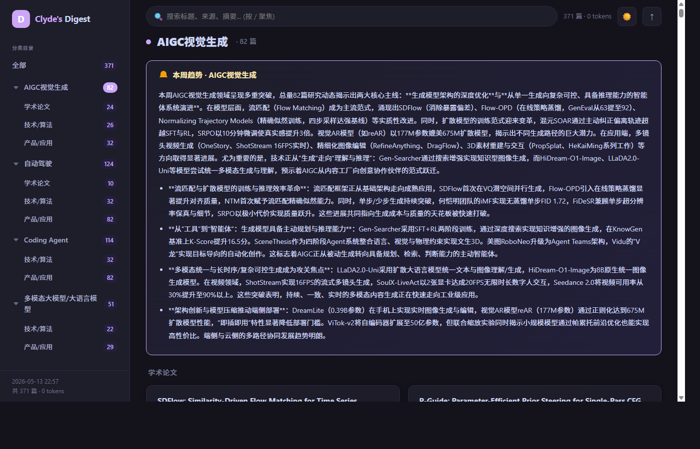
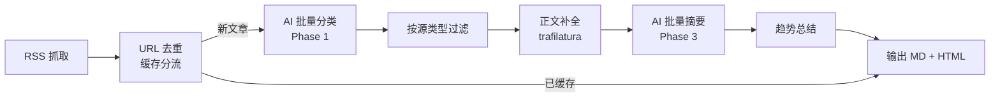

# DigestMe — AI 驱动的 RSS 智能摘要

<p align="center">
  <strong>97+ 信源 · AI 分类 · 双语摘要 · 趋势分析 · 交互式报告</strong>
</p>

<p align="center">
  <a href="https://www.python.org/downloads/"></a>
  <a href="https://aphroditee666.github.io/DigestMe/"></a>
  
</p>

> **Live Demo:** [aphroditee666.github.io/DigestMe](https://aphroditee666.github.io/DigestMe/)

---



*交互式 HTML 仪表盘：暗色/亮色切换、全文搜索、侧边栏分类导航、可拖拽侧边栏、渐变摘要卡片、滚动联动、移动端适配*

---

## 项目介绍

DigestMe 是一个 AI 驱动的 RSS 智能摘要系统。每天从 97+ 个 RSS 信源抓取 ~370 篇文章，通过大语言模型自动分类、去噪、补全正文、批量摘要，最终产出精美的 Markdown + 可交互 HTML 日报。

适合谁用：
- **AI 研究员** — 持续追踪 AIGC、多模态、自动驾驶等前沿领域
- **工程团队** — 无需翻遍 Twitter/公众号/ArXiv，一份日报涵盖关键动态
- **技术博主** — 每天获取新鲜素材和趋势洞察
- **领域跟踪者** — 一键更换 prompt 模块即可定制跟踪领域

### 功能特性

| 功能 | 说明 |
|------|------|
| 多源聚合 | 97+ RSS 信源，覆盖公众号、技术博客、ArXiv、GitHub 等 |
| AI 智能分类 | 批量分类为 AIGC 视觉生成 / 自动驾驶 / Coding Agent / 多模态 LLM 四大领域 |
| 双语摘要 | 中文要点 + 英文摘要，兼顾深度与广度 |
| 全文补全 | trafilatura 自动抓取原文补充短 RSS 摘要，提升摘要质量 |
| 趋势分析 | 每期自动生成各分类的趋势总结，一目了然 |
| 交互式仪表盘 | 可搜索、可导航、可切换暗色的精美 HTML 报告 |
| 智能缓存 | URL 级去重缓存，避免重复 LLM 调用，节省 Token |
| 双格式输出 | 同时产出 Markdown（归档友好）+ HTML（阅读友好） |
| LLM 无关 | 兼容 Anthropic 协议，DeepSeek / Claude / OpenAI 任意切换 |
| CI/CD 就绪 | GitHub Actions 定时抓取 + 自动提交，零手动维护 |
| 领域可更换 | 复制 prompt 模块 → 修改分类定义 → 更换 RSS 源 → 即刻切换领域 |

---

## Live Demo

- **最新 HTML 报告:** [aphroditee666.github.io/DigestMe](https://aphroditee666.github.io/DigestMe/)
- **历史摘要索引:** [output/README.md](output/README.md)

---

## 工作流程



---

## 快速开始

### 前置要求

- Python 3.10+
- LLM API Key（推荐 DeepSeek，性价比高）

### 安装运行

```bash
# 1. 克隆仓库
git clone https://github.com/aphroditee666/DigestMe.git
cd DigestMe

# 2. 安装依赖
pip install -r requirements.txt

# 3. 配置环境变量
export DEEPSEEK_API_KEY="your-api-key"

# 4. 使用入门配置进行首次运行（仅 3 个信源，快速验证）
python main.py --once --config config/ai_digest/ci.yaml

# 5. 使用完整配置运行（97+ 信源）
python main.py --once --config config/ai_digest/config_ai_digest_outer_rss_merge_v0.yaml
```

---

## 配置指南

### 关键配置字段

| 字段 | 类型 | 默认值 | 说明 |
|------|------|--------|------|
| `rss_sources[].name` | string | — | RSS 源名称（用于显示） |
| `rss_sources[].url` | string | — | RSS 地址（空字符串跳过） |
| `rss_sources[].category` | string | — | 分类名，`"学术论文"` 为特殊学术源 |
| `rss_sources[].limit` | int | — | 单源抓取上限 |
| `rss_sources[].enrich` | bool | `false` | Tier 1 开关：开启后正文补全 + subtype 自动标记为 `技术/算法` |
| `claude.api_key` | string | — | LLM API Key，支持 `${ENV_VAR}` 展开 |
| `claude.base_url` | string | — | LLM API 地址（兼容 Anthropic 协议） |
| `claude.model` | string | — | 模型名称，如 `deepseek-v4-flash` |
| `digest.recent_days` | int | `4` | 抓取最近 N 天的文章 |
| `digest.classification_batch_size` | int | `30` | 每批分类文章数 |
| `digest.summarization_batch_size` | int | `5` | 每批摘要文章数 |
| `digest.enable_trend_summary` | bool | `true` | 是否生成趋势总结 |
| `output.output_format` | string | `"both"` | 输出格式：`markdown` / `html` / `both` |
| `output.base_dir` | string | `"./output"` | 输出目录 |
| `schedule.days` | list | — | 调度日期，如 `["monday", "thursday"]` |
| `schedule.time` | string | — | 调度时间，如 `"09:00"` |

### Tier 1 / Tier 2 策略

DigestMe 采用两层处理策略来平衡质量与成本：

- **Tier 1（`enrich: true`）**：完整正文抓取 + 精细摘要 + 自动标记为 `技术/算法` subtype。适合内容质量高、需要深度摘要的信源。
- **Tier 2（`enrich: false`）**：基于 RSS 摘要直接生成摘要 + 标记为 `产品/应用` subtype。适合信息密度较低的信源。

### 更换领域

DigestMe 的领域分类由 `prompts_module` 驱动。如需切换到其他领域（如医疗、金融、法律）：

1. 复制 `src/prompts_ai_digest.py` → `src/prompts_medical.py`
2. 修改 `CATEGORIES` 字典中的分类定义
3. 更新 `CATEGORIES_TO_OUTPUT` 列表
4. 在配置文件中设置 `digest.prompts_module: src.prompts_medical`
5. 更换 `rss_sources` 为对应领域的信源

---

## 使用模式

| 命令 | 说明 |
|------|------|
| `python main.py --once` | 单次运行：抓取 → 分类 → 摘要 → 输出 |
| `python main.py --once --config config/ai_digest/ci.yaml` | 指定配置文件运行 |
| `python main.py --render-only --config config/ai_digest/ci.yaml` | 仅从缓存重新渲染 MD + HTML（不抓取，不调 LLM） |
| `python main.py` | 定时调度模式，按配置中的 schedule 自动运行 |

> Windows 用户注意：如遇 GBK 编码错误，设置 `set PYTHONIOENCODING=utf-8`。

---

## HTML 仪表盘功能

生成的 HTML 报告具有以下交互功能：

| 功能 | 说明 |
|------|------|
| 暗色/亮色切换 | 一键切换主题，阅读体验友好 |
| 全文搜索 | 实时过滤文章标题与摘要内容 |
| 侧边栏导航 | 按分类快速跳转 |
| 可拖拽侧边栏 | 自由调整侧边栏宽度 |
| 滚动联动 | 侧边栏高亮跟随正文滚动位置 |
| 渐变卡片 | 每篇文章使用渐变摘要卡片展示 |
| 移动端适配 | 响应式布局，手机上同样好读 |
| 键盘快捷键 | 支持键盘导航操作 |
| arXiv / GitHub 徽章 | 自动识别并显示论文 / 仓库来源徽章 |
| 趋势摘要卡片 | 顶部展示各分类的趋势总结 |

---

## 项目规模

| 指标 | 数据 |
|------|------|
| RSS 信源 | 97+ (最新配置 99) |
| 单次抓取量 | ~370 篇 |
| AI 分类数 | 4 个输出分类 + 1 个杂项过滤 |
| 输出大小 | MD ~500KB / HTML ~1MB |
| 支持模型 | DeepSeek / Claude / OpenAI（兼容 Anthropic 协议） |

---

## GitHub Actions CI/CD

项目包含 GitHub Actions 工作流（[`.github/workflows/digest.yml.disabled`](.github/workflows/digest.yml.disabled)），默认处于禁用状态。启用步骤：

1. 将 `digest.yml.disabled` 重命名为 `digest.yml`
2. 在仓库 Settings → Secrets and variables → Actions 中添加 `DEEPSEEK_API_KEY`
3. 如需修改调度时间，编辑 `cron` 表达式（当前：每周一、四 UTC 06:30 = 北京时间 14:30）
4. 手动触发或等待定时执行

工作流会自动抓取、生成日报，并将 `output/` 目录提交回仓库。配合 GitHub Pages 即可实现在线发布。

---

## 技术栈

| 类别 | 技术 |
|------|------|
| 语言 | Python 3.10+ |
| RSS 抓取 | [feedparser](https://github.com/kurtmckee/feedparser) |
| 全文提取 | [trafilatura](https://github.com/adbar/trafilatura) |
| AI 接口 | [anthropic SDK](https://github.com/anthropics/anthropic-sdk-python) (Anthropic 协议兼容) |
| 配置管理 | PyYAML + `${ENV_VAR}` 环境变量展开 |
| 任务调度 | [schedule](https://github.com/dbader/schedule) |
| CI/CD | GitHub Actions |
| 前端 | 原生 HTML + CSS + JS (零框架依赖) |

---

## 项目结构

```
DigestMe/
├── main.py                        # 主入口，编排完整 pipeline
├── render.py                      # 独立渲染脚本
├── src/
│   ├── claude_client.py           # Anthropic SDK 封装（Lazy init，Token 统计）
│   ├── config_loader.py           # YAML 配置解析 + 环境变量展开
│   ├── rss_fetcher.py             # RSS 抓取引擎（feedparser 封装）
│   ├── custom_fetcher.py          # 定制抓取器（arXiv API、Meta AI Blog）
│   ├── summarizer.py              # AI 分类 + 摘要 + 趋势总结
│   ├── prompts_ai_digest.py       # 分类定义 + 系统提示词（可按领域替换）
│   ├── digest_cache.py            # JSON 文件缓存，URL 级去重
│   ├── full_text_fetcher.py       # 全文补全（trafilatura-based）
│   ├── markdown_writer.py         # Markdown 输出
│   ├── html_writer.py             # HTML 交互式仪表盘生成
│   └── scheduler.py               # 定时调度
├── config/ai_digest/              # 配置文件目录
│   ├── ci.yaml                    # 入门配置（3 信源，快速验证）
│   └── config_ai_digest_*.yaml    # 完整配置（97+ 信源）
├── output/                        # 生成的日报输出目录
├── tests/                         # 单元测试 + 集成测试
└── scripts/                       # 辅助脚本
```

---

## 定制 / Fork 指南

想要跟踪你自己关注的领域？

1. **Fork 本仓库**
2. **复制 prompt 模块**：`cp src/prompts_ai_digest.py src/prompts_my_domain.py`
3. **修改分类定义**：编辑 `CATEGORIES` 字典，定义你关心的领域
4. **更新输出分类**：修改 `CATEGORIES_TO_OUTPUT` 列表
5. **创建配置文件**：更换 `rss_sources` 和 `digest.prompts_module`
6. **运行测试**：`python main.py --once --config config/my_domain.yaml`
7. **（可选）设置 GitHub Actions + GitHub Pages** 实现自动化发布

---

## 贡献 & 致谢

Issues 和 PRs 欢迎！如果你有新功能想法或发现了 Bug，欢迎提交。

致谢以下项目和服务：

- [RSSHub](https://github.com/DIYgod/RSSHub) — 万物皆可 RSS
- [DeepSeek](https://www.deepseek.com/) — 高性价比 LLM API
- [feedparser](https://github.com/kurtmckee/feedparser) — Python RSS 解析库
- [trafilatura](https://github.com/adbar/trafilatura) — 网页正文提取
- [Anthropic](https://www.anthropic.com/) — Claude API
